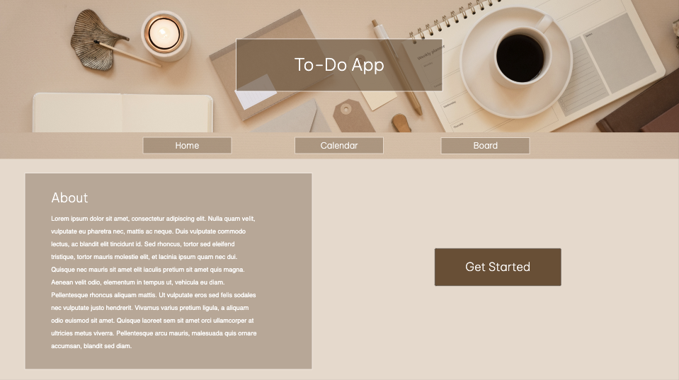
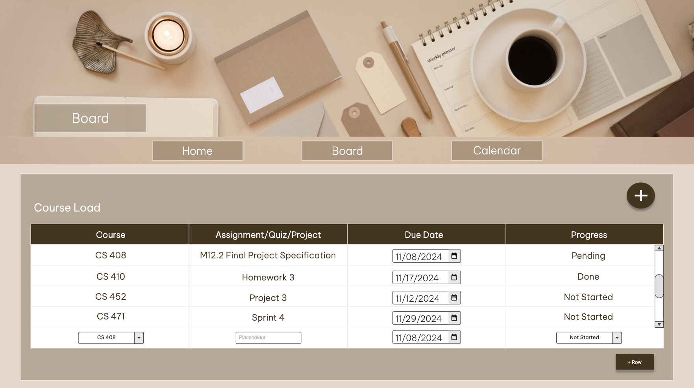
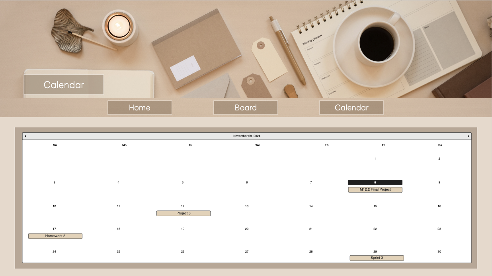

# Final Project

## Project Spec

### What is the general theme?
  - A To-Do app. I want to try doing a simple to-do app and start simple, if time permits I would like to add more complex implementations that could make it more interesting. My inspo is the Notion App, I really like how I can customize the functionality of a todo app.
### What is it going to do?
  - It will keep track of the to-do list, add items to the to-do list, delete when completed an item, a calendar will list the to-do item that is due at that day, and a to-do item can have attributes such as in-progress/completed, course related, when it's due, homework/quiz/project/exam, etc. 
### Who is the target audience?
  - Anyone can use the to-do app. I might focus more on the academic side, but generally anyone can use it.
### What sort of data will it manage?
  - It will manage the title of a task, course related or section, date it's due, and the progress. Adding a new table allows for either academic related, chores, grocery, cleaning, or exercising might also work.
### Stretch Goals?
  - I mentioned a calendar that will list the task on when it's due, I'm not sure how complex it might be but it's one of the functionality that helps me a lot so I want to recreate that, hopefully I'll be able to! I might not be able to make the website as exactly how I created my wireframe, especially the calendar but I will try my best!

## Project Wireframe

## Sources
- https://www.geeksforgeeks.org/set-the-opacity-only-to-background-color-not-on-the-text-in-css/
- https://stackoverflow.com/questions/2626039/css-rgba-border-background-alpha-double
- https://stackoverflow.com/questions/12381721/background-image-border
- https://www.w3schools.com/howto/tryit.asp?filename=tryhow_css_calendar